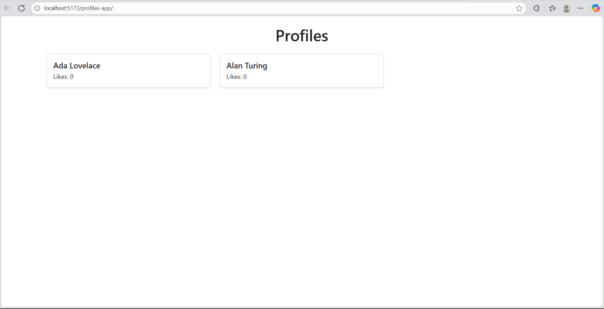
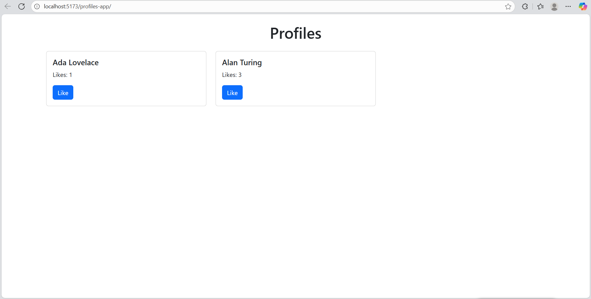
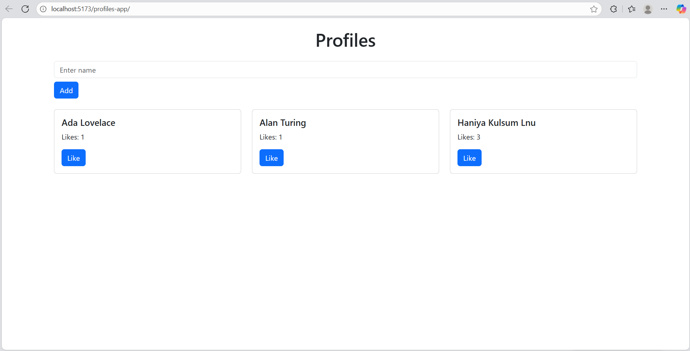

# Profiles App

Profiles App is a simple React application built with Vite.  
It demonstrates the use of React components, props, and integration with 

**React-Bootstrap**.  
The app begins by displaying a “Hello React” message and later adds dynamic profile cards rendered with `.map()`.


## Part 1 – Setup and React-Bootstrap
The commit that added React-Bootstrap and the “Hello React” display:

**Commit:** [Added React Bootstrap and updated App component with Hello React UI]
url: (https://github.com/Haniya-kulsum/profiles-app/commit/7f7e2833654309221945e778fcf9391abf519308)

## live Demo 

https://haniya-kulsum.github.io/profiles-app/

**Screenshot:**  


## part 2

## live Demo 

https://haniya-kulsum.github.io/profiles-app/
 


## Part 3 – Components and Props

This part demonstrates rendering multiple components dynamically using React’s `.map()` function.  
Each profile card displays a name and a like count.

## Commit Link: 
(https://github.com/Haniya-kulsum/profiles-app/commit/517ac887ac607bf930de00a38c92b3318a14d8ab)

## Screenshot:

 ## Live Demo

 [View Live App](https://haniya-kulsum.github.io/profiles-app/)


 ## Part 4 — Stateful Likes
- Each profile card has a Like button.
- Clicking Like increments the profile's likes immediately.
- State updates are handled using `useState`.



## Part 5 — Add New Profiles
- Controlled form input allows adding new profiles.
- Validation rules:
  - Name is required (cannot be empty).
  - Name must be unique among existing profiles.
- Inline feedback is shown for errors.
- New profiles start with 0 likes and appear immediately on submission.

## Adding a new profile successfully


## Empty name validation error


## Duplicate name validation error


##  Tech Stack

- React + Vite  
- React-Bootstrap  
- GitHub Actions (for deployment via Pages)


##  Run Locally

```bash
npm install
npm run dev